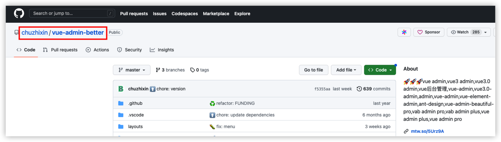

# mall-cli-project

# 项目说明
前端脚手架工具，能够快速从自己gitlab仓库中拉出模板代码，并下载代码、下载依赖

# 更新记录
1. 2023-04-28 修复不支持写入gitlab仓库地址的bug
2. 2023-04-25 支持自定义模板【支持：gitee、github、gitlab】
3. 2023-04-23 加入模板版本选择（使用tag作为版本）
4. 2023-04-21 增加此脚手架新版本提示（使用mall-cli create 或 mall-cli write时提示）

# 待完成

# 功能说明
命令：
- 下载包：npm install -g mall-cli-project
- 执行命令，写入你gitlab仓库地址： mall-cli set 'xxx' 
- 执行命令，写入你自己gilab的AccessToken： mall-cli write 'xxx' 
- 执行命令，创建项目： mall-cli create xxx 
- 执行命令，添加自定义模板：mall-cli add xxx （xxx为模板地址，支持gitee、github、gitlab）
- 执行命令，移除自定义模板：mall-cli remove xxx （xxx为模板地址）
- 执行命令，清空自定义模板：mall-cli clear

# mall-cli add xxx 命令说明
1. 此命令可以添加自定义模板目录，xxx为模板地址
2. 仅支持https协议的clone地址，不支持shh
3. 如果使用gitee或者gitlab，xxx值 为clone地址（栗子：mall-cli add https://gitee.com/xxx/xx.git）
4. 如果使用github, xxx值 为clone地址，可能会拉取代码失败，原因你懂得；推荐使用：
    
    栗子：mall-cli add chuzhixin/vue-admin-better

# 规范
由于gitlab仓库的项目有很多，我们这里规定所有项目名称以“template-”开头的即为模板代码，此工具只会筛选template-开头的项目列表供选择

# 源码使用说明
1. 下载此项目源码
2. 在项目根目录打开命令终端
3. 执行命令 npm link，将此脚手架命令 创建全局软链
4. 执行命令 mall-cli set 'xxx' 写入你自己gilab仓库地址
5. 执行命令 mall-cli write 'xxx' 写入你自己gilab的AccessToken
6. 执行命令 mall-cli create xxx 创建项目

# 补充
AccessToken生成方式：
1. 打开gitlab并登录
2. 点击头像 - settting - Access Tokens
3. 输入Name和Expires at
4. 勾选上 api Access the authenticated user's API
        read_repository Read Repository
5. 最后点击创建（Create personal access token）

